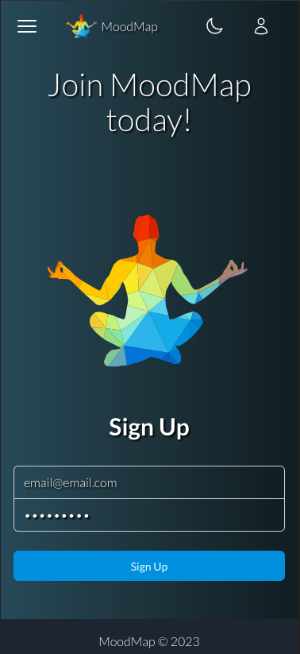
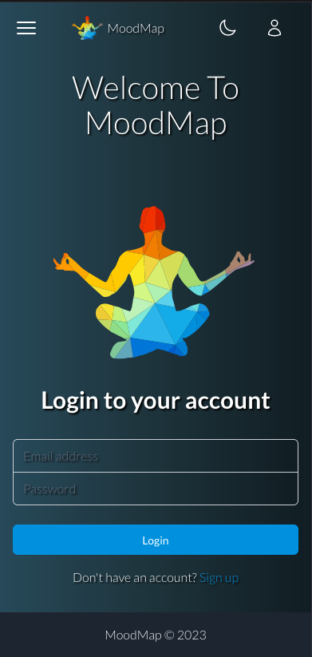
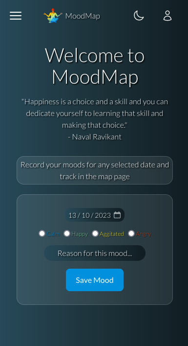
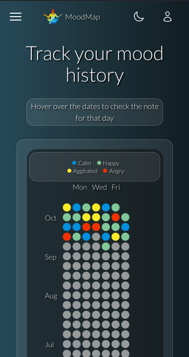
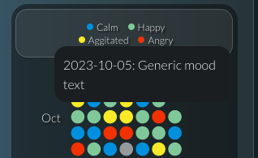
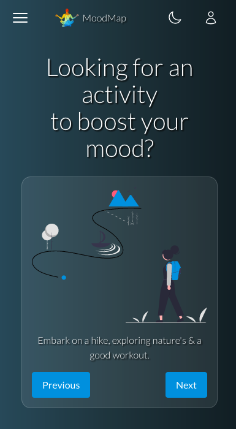
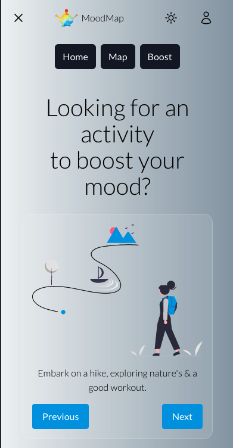
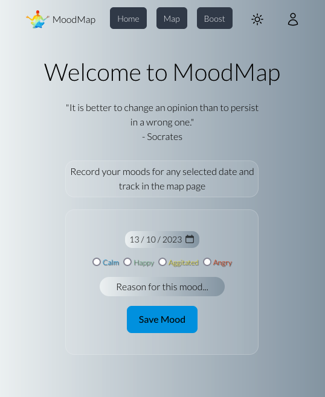

# MoodMap

The Mood Map app allows users to track and record their moods on a daily basis. Users can select a date, choose a mood color, and add a note to describe their mood. The app stores this data for future reference.

## Table of Contents

- [Introduction](#introduction)
- [Features](#features)
- [Installation](#installation)
- [Usage](#usage)
- [Screenshots](#screenshots)
- [Dependencies](#dependencies)
- [Future Features](#future-features)

## Features

- Mock Authentication (This is purely to mock authentication to make it feel like a          production app, data is stored in local storage to achieve this)
- Random Zen Quote displayed on the home page
- Select a date to record your mood.
- Choose a mood color from the available options.
- Add a note to describe your mood.
- View and analyze your mood history.
- Hover over any date on the map to see what your noite was on that date
- Dark/Light mode

## Installation

To run the MoodMap app locally, follow these steps:

1. Clone the repository.
2. Install dependencies using `npm install`.
3. Start the development server using `npm run dev`.

## Usage

1. Sign up or log in to the app.
2. Navigate to the mood input page to record your mood.
3. Explore the mood map to view your mood history.
4. Customize your profile and settings on the Profile page.

## Screenshots

## Dependencies

- **Vue 3** with Composition API: Reactive and composable component logic.
- **Vite**: Efficient and fast frontend tooling.
- **Pinia**: Intuitive state management.
- **SCSS**: Enhanced styling capabilities.
- **Vue Router**: Effective routing and navigation.
- **sweetalert2**: customisable pop-ups.
- **TailWindCSS**: For styling.

## Future Features

- **Profile Page**: Customize user profiles and settings.
- **Advanced mood tracking analytics**: mood streaks, trends etc.
- **Favourite boosts**: Add favourites from mood boosts or completion awards.

